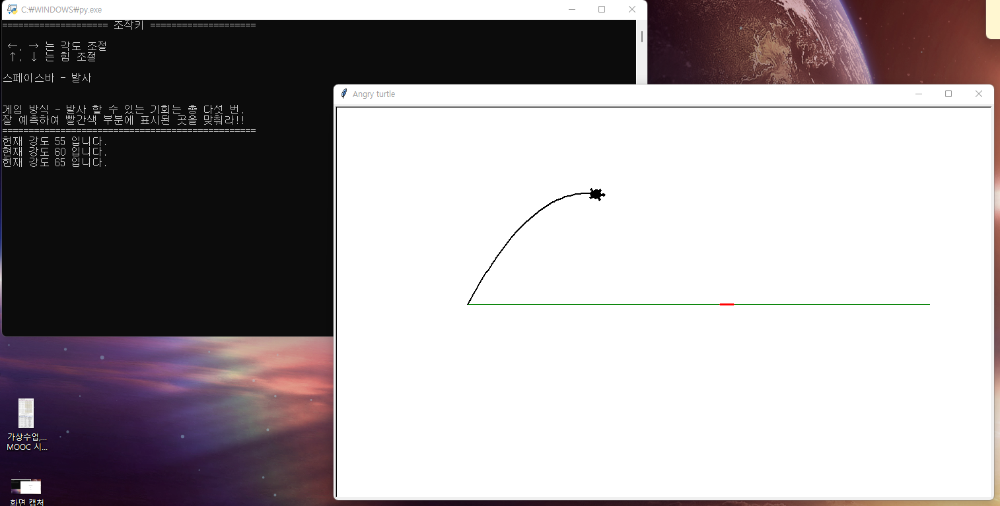
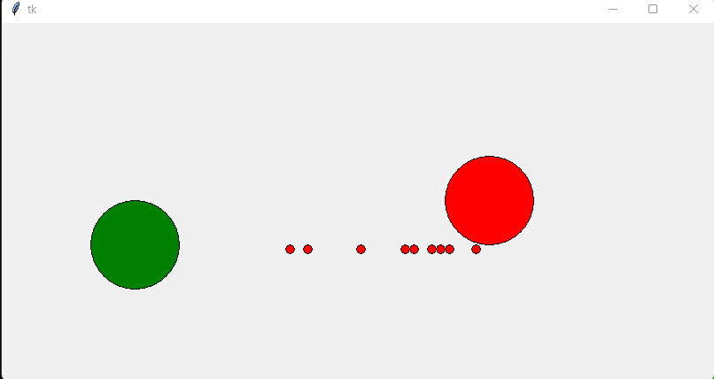

# 💻 컴퓨터프로그래밍 기초 (Python)

**[과목 정보]**
- **수강:** 1학년 2학기
- **언어:** `Python`
- **핵심:** `OOP 기초`, `GUI 프로그래밍`, `알고리즘 적용`

---

## 📖 과목 개요 (Overview)
Python을 활용해 프로그래밍의 핵심 원리를 실제 코드로 구현하며 **체계적인 소프트웨어 개발의 기반을 구축**한 과목입니다. 객체 지향 프로그래밍(OOP)과 GUI 라이브러리(Tkinter, Turtle)를 통해 아이디어를 실제 동작하는 애플리케이션으로 만드는 과정을 경험했습니다.

## 🚀 주요 프로젝트 (Key Projects)

### 1. 물리 엔진 기반 캐논 슈팅 게임
- **프로젝트 파일**: `angry-turtle.py`, `fortress-game-console.py`
- **핵심 역량**: `OOP`, `Turtle Graphics`, `수학/물리 로직 적용`
- **설명**: 물리 공식(포물선 운동)을 적용하여 각도와 힘을 조절해 목표물을 맞추는 캐논 슈팅 게임입니다. 동일한 게임 로직을 **GUI(Turtle) 환경과 텍스트(Console) 환경** 모두에서 동작하도록 구현하며 응용력을 높였습니다.
- **성장 포인트**:
    - `Player`와 `Cannonball` 객체를 **클래스로 설계**하여 게임의 상태와 동작을 효율적으로 관리하며 코드의 재사용성을 높였습니다.
    - 동일한 비즈니스 로직을 서로 다른 프레젠테이션(GUI, Console)에 적용하는 경험을 통해, **로직과 화면의 분리**라는 중요한 설계 원칙을 처음으로 체득했습니다.

**[Demo]**

*
Turtle 그래픽을 활용한 GUI 버전
*

---

### 2. GUI 객체 시뮬레이션
- **프로젝트 파일**: `ball-simulation-tkinter.py`
- **핵심 역량**: `OOP`, `Tkinter`, `GUI 이벤트 처리`
- **설명**: Tkinter GUI 환경에서 다수의 공(Ball) 객체들이 독립적으로 움직이고 벽에 충돌하며 튕겨 나오는 물리 시뮬레이션입니다.
- **성장 포인트**:
    - `Ball` 클래스를 통해 **다수의 객체를 효율적으로 생성하고 관리**하는 방법을 학습했습니다.
    - 각 객체의 상태(위치, 속도)를 업데이트하는 게임 루프의 기본 구조를 이해했으며, 이는 향후 복잡한 시스템의 구성 요소를 모델링하는 데 중요한 기초가 되었습니다.

**[Demo]**

*
Tkinter로 구현한 공 시뮬레이션
*

---
> ↩️ **[전체 학습 로드맵으로 돌아가기](../../README.md)**
