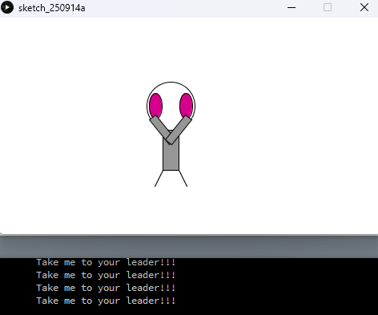

# 소프트웨어 개발 입문 (Introduction to Software Development)

**수강 학년:** 1학년 1학기 (1st Grade, 1st Semester)

## 📖 과목 소개 & 배운 점

블록 기반 코딩 도구인 **App Inventor**와 시각적 디자인을 위한 프로그래밍 언어 **Processing**을 활용하여, 소프트웨어 개발의 핵심 원리와 프로그래밍 논리를 학습한 과목입니다. 텍스트 코딩 이전에, 이벤트 처리와 객체 활용 등 프로그래밍의 근본적인 개념을 시각적이고 직관적인 방식으로 익히며 소프트웨어 개발에 대한 흥미를 키울 수 있었습니다.

## 🛠️ 사용 도구

-   **App Inventor**
-   **Processing**

## 💡 주요 개발 프로젝트

### 1. 구구단을 외자! (App Inventor)
-   **소스 파일:** `gugudan-trainer-app.aia`
-   **프로젝트 설명:**
    -   단순한 구구단 문제를 넘어, **난이도 조절(쉬움, 보통, 어려움)** 및 **연습 모드**를 제공하는 기능성 안드로이드 앱입니다.
    -   **타이머 기능**을 도입하여, 문제당 10초의 제한 시간을 두고 시간이 3초 이하로 남으면 화면이 붉게 변하는 시각적 효과를 구현했습니다.
    -   **일시정지/재시작 기능**과 버튼 클릭 시 **효과음**을 추가하여 사용자 경험(UX)을 개선했습니다.

-   **배운 점:**
    -   다수의 버튼, 레이블, 레이아웃 컴포넌트를 체계적으로 배치하며 **복잡한 모바일 UI를 설계**하는 능력을 길렀습니다.
    -   타이머(Clock) 컴포넌트와 조건문을 활용하여 **시간제한, 난이도별 로직 분기** 등 복합적인 이벤트 처리 능력을 학습했습니다.
    -   사용자의 행동에 따라 적절한 피드백(팝업, 화면 색상 변경, 효과음)을 제공하며 **사용자 중심적인 앱을 고민**하는 경험을 했습니다.

**[실행 화면]**

### 2. Processing을 활용한 인터랙티브 캐릭터 구현
-   **소스 파일:** `interactive-zoog.pde`
-   **프로젝트 설명:**
    -   강의에서 배운 **변수, 인터랙션, 조건문, 반복문, 함수, 2D 변환** 등 모든 핵심 개념을 종합하여 **'인터랙티브 Zoog'** 캐릭터를 구현했습니다. Zoog는 마우스를 따라 움직이고, 자연스럽게 팔을 흔들며, 마우스를 클릭하면 메시지를 출력하는 등 사용자의 입력에 동적으로 반응합니다.
-   **배운 점:**
    -   여러 프로그래밍 개념을 통합하여 하나의 완성된 인터랙티브 애니메이션을 만드는 프로젝트 관리 능력을 길렀습니다.
    -   특히, `translate()`와 `rotate()`를 활용한 좌표계 변환을 통해 복잡한 움직임을 구현하는 원리를 깊이 있게 이해했습니다.

**[실행 화면]**

변수, 조건문, 함수 등을 종합적으로 활용하여 만든 'Zoog' 캐릭터 애니메이션.

---

## ✍️ 관련 학습 노트

-   **C#, C++, Java, Python 언어별 특징 요약 노트:**
    -   각 객체 지향 언어들의 핵심적인 특징과 장단점을 비교 분석하며 프로그래밍 언어에 대한 폭넓은 시야를 기르고자 노력했습니다.

