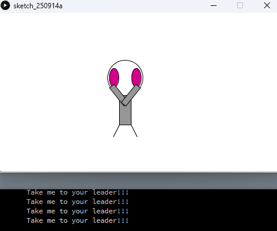
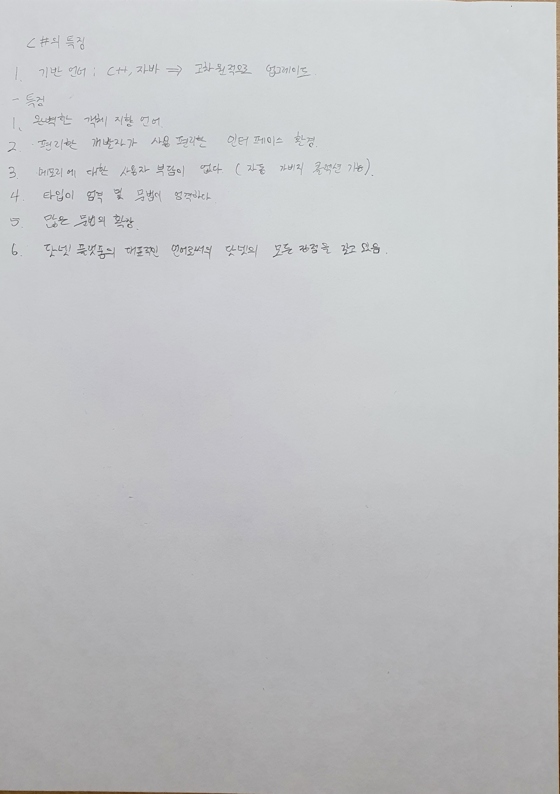

# Introduction to Software Development — 1학년 실습 모음

App Inventor와 Processing으로 이벤트 기반 로직과 상호작용(UX)을 연습한 실습 모음입니다. 상태 관리와 입력 검증, 타이머 등 기초 개념을 실제 결과물에 적용하는 데 중점을 두었습니다.

## Quick start
- Processing: interactive-zoog.pde 열기 → Run
- App Inventor: AI2에서 gugudan-trainer-app.aia 가져오기 → Connect (에뮬레이터 또는 기기)

## 데모 스크린샷
<table>
<tr>
<td align="center"><strong>구구단 트레이너 (App Inventor)</strong></td>
<td align="center"><strong>Interactive Zoog (Processing)</strong></td>
</tr>
<tr>
<td></td>
<td></td>
</tr>
</table>

## 프로젝트 목록

| Name                       | Tech         | 한 줄 설명                               | 실행/열기                             |
|---------------------------|--------------|------------------------------------------|---------------------------------------|
| 구구단 트레이너           | App Inventor | 입력 검증과 피드백 중심의 학습 앱        | gugudan-trainer-app.aia (AI2로 열기)  |
| Interactive Zoog (스케치) | Processing   | 키 입력에 반응하는 인터랙티브 그래픽     | Processing IDE로 interactive-zoog.pde |

## 핵심 학습 포인트
- 이벤트 기반 로직과 상태 관리 분리
- 입력 검증과 사용자 피드백(시각/청각)
- 타이머 기반 업데이트와 화면 갱신 분리
- 간단한 객체지향 렌더링 패턴

## 사용 방법
- App Inventor: https://ai2.appinventor.mit.edu 접속 → Projects → Import project (.aia) from my computer → gugudan-trainer-app.aia → Connect로 실행
- Processing: Processing IDE에서 interactive-zoog.pde 열기 → Run

## 디렉터리
```
assets/                       # 스크린샷/이미지
gugudan-trainer-app.aia       # App Inventor 프로젝트 파일
interactive-zoog.pde          # Processing 스케치
README.md                     # 이 파일
```

## 노트 스냅샷
<table>
<tr>
<td align="center"><strong>언어별 특징 비교 노트 1</strong></td>
<td align="center"><strong>언어별 특징 비교 노트 2</strong></td>
</tr>
<tr>
<td></td>
<td></td>
</tr>
</table>

## 라이선스
MIT

## 링크
- Notion 과목 정리: https://www.notion.so/da2f0b466abf4e7e9cc791b918da8578
