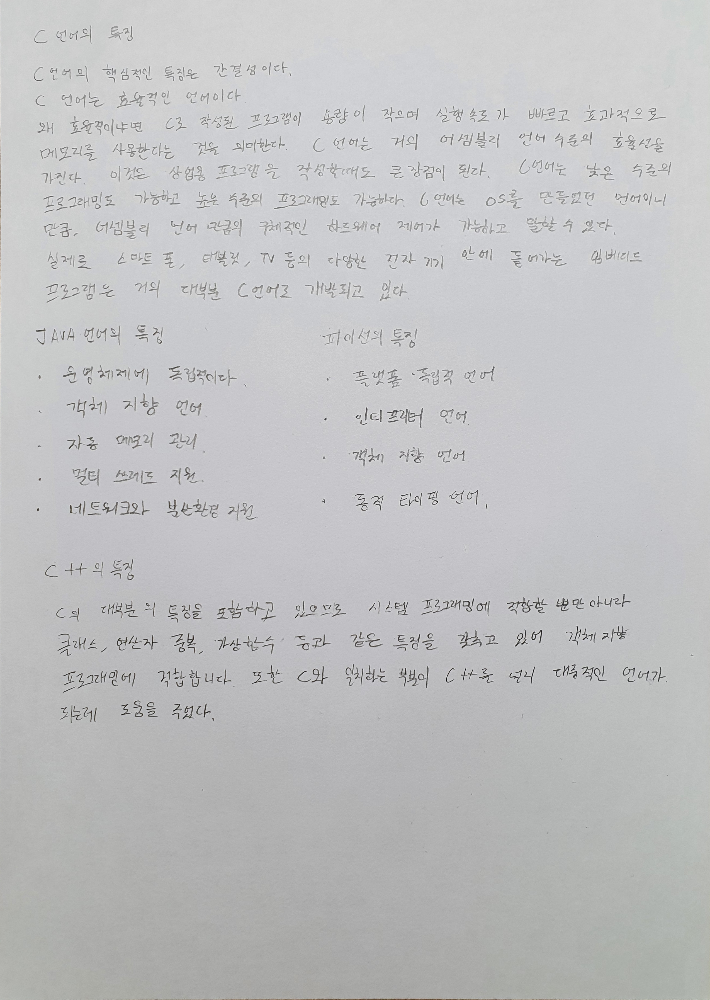
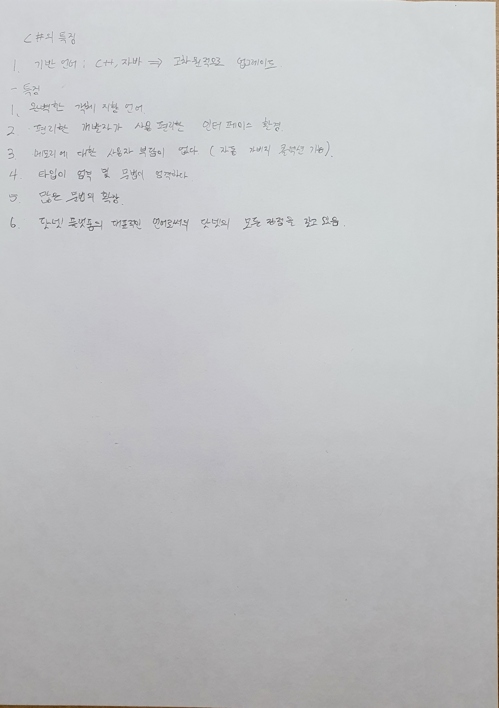

# 소프트웨어 개발 입문 (Introduction to Software Development)

**수강 학년:** 1학년 1학기 (1st Grade, 1st Semester)

## 📖 과목 소개 & 배운 점

블록 기반 코딩 도구인 **App Inventor**와 시각적 디자인을 위한 프로그래밍 언어 **Processing**을 활용하여, 소프트웨어 개발의 핵심 원리와 프로그래밍 논리를 학습한 과목입니다. 텍스트 코딩 이전에, 이벤트 처리와 객체 활용 등 프로그래밍의 근본적인 개념을 시각적이고 직관적인 방식으로 익히며 소프트웨어 개발에 대한 흥미를 키울 수 있었습니다.

## 🛠️ 사용 도구

-   **App Inventor**
-   **Processing**

## 💡 주요 개발 프로젝트

### 1. 구구단을 외자! (App Inventor)
-   **프로젝트 설명:**
    -   [cite_start]단순한 구구단 문제를 넘어, **난이도 조절(쉬움, 보통, 어려움)** 및 **연습 모드**를 제공하는 기능성 안드로이드 앱입니다. [cite: 382]
    -   [cite_start]**타이머 기능**을 도입하여, 문제당 10초의 제한 시간을 두고 시간이 3초 이하로 남으면 화면이 붉게 변하는 시각적 효과를 구현했습니다. [cite: 381]
    -   [cite_start]**일시정지/재시작 기능**과 버튼 클릭 시 **효과음**을 추가하여 사용자 경험(UX)을 개선했습니다. [cite: 379, 383]

-   **배운 점:**
    -   [cite_start]다수의 버튼, 레이블, 레이아웃 컴포넌트를 체계적으로 배치하며 **복잡한 모바일 UI를 설계**하는 능력을 길렀습니다. [cite: 384, 385, 386, 387, 388, 389]
    -   [cite_start]타이머(Clock) 컴포넌트와 조건문을 활용하여 **시간제한, 난이도별 로직 분기** 등 복합적인 이벤트 처리 능력을 학습했습니다. [cite: 392, 393]
    -   [cite_start]사용자의 행동에 따라 적절한 피드백(팝업, 화면 색상 변경, 효과음)을 제공하며 **사용자 중심적인 앱을 고민**하는 경험을 했습니다. [cite: 394]

### 2. Processing을 활용한 인터랙티브 아트 (Processing)
-   **프로젝트 설명:**
    -   Processing을 이용하여 간단한 그래픽 요소를 만들고, 사용자의 입력에 따라 상호작용하는 시각적인 결과물을 제작했습니다.
-   **배운 점:**
    -   객체의 개념과 좌표 시스템을 이해하고, 알고리즘을 시각적으로 구현하는 방법을 학습했습니다.

---

## ✍️ 관련 학습 노트

-   **C#, C++, Java, Python 언어별 특징 요약 노트:**
    -   각 객체 지향 언어들의 핵심적인 특징과 장단점을 비교 분석하며 프로그래밍 언어에 대한 폭넓은 시야를 기르고자 노력했습니다.

