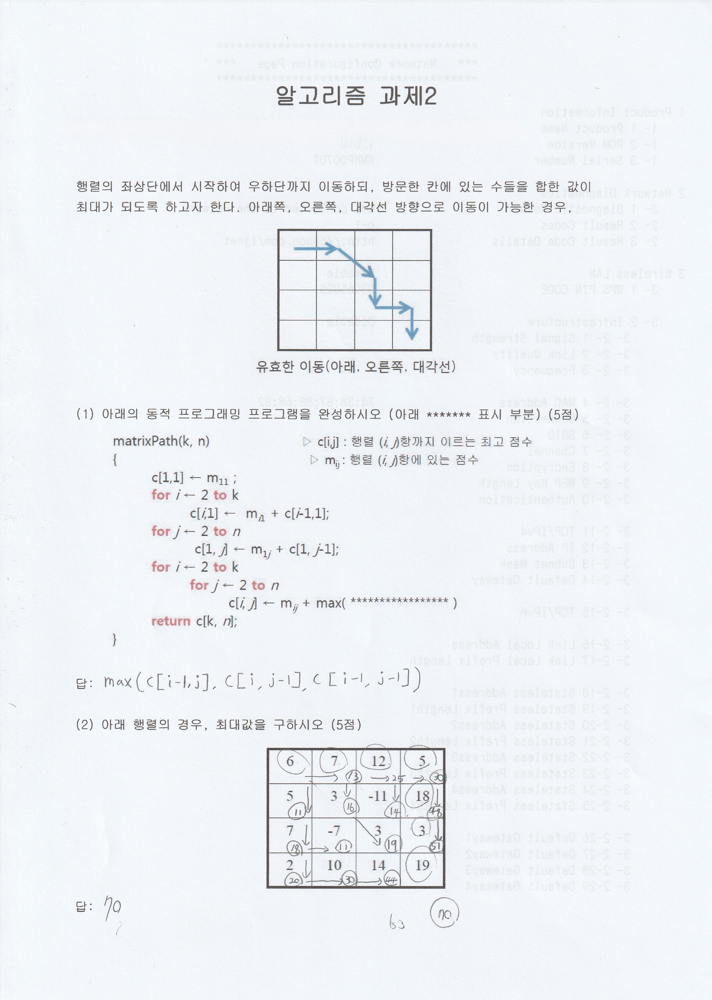

# Algorithms — 2학년 정리

복잡도 분석과 알고리즘 설계 패러다임(분할정복, 그리디, DP, 그래프)을 실습으로 정리한 저장소입니다.

## Quick start
- Python 3.10+
- 가상환경 권장
```bash
python -m venv .venv && source .venv/bin/activate  # Windows: .\.venv\Scripts\activate
pip install -r requirements.txt  # 필요 시
```

## 데모 스크린샷
<table>
<tr>
<td align="center"><strong>선택 정렬 실행 결과</strong></td>
<td align="center"><strong>DP 행렬 경로 최대합</strong></td>
</tr>
<tr>
<td></td>
<td></td>
</tr>
</table>

## 학습 주제
- 시간·공간 복잡도: O, Ω, Θ와 상수항 vs 차수
- 분할정복: Merge Sort, Quick Sort
- 그래프 탐색: BFS/DFS, 무가중 최단경로는 BFS
- 그리디: 활동 선택, 전제 점검과 교환 논법
- 동적 계획법(DP): 점화식, 테이블링, 경로 복원

## 예제 코드
- selection-sort.py: 선택 정렬과 단계별 상태 출력
- bfs_shortest.py: 무가중 그래프 최단거리
- edit_distance.py: Levenshtein 거리(bottom-up DP)
- merge_sort.py: 분할정복 정렬

## 실행 예
```bash
python selection-sort.py
python bfs_shortest.py
python edit_distance.py
```

## 디렉터리
```
assets/                          # 스크린샷
selection-sort.py
bfs_shortest.py
edit_distance.py
merge_sort.py
README.md
```

## 참고
- Notion 정리: https://www.notion.so/d30f2ca47cfb4a92b7762d4c4f23bf68

