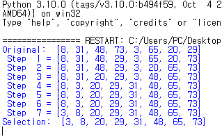
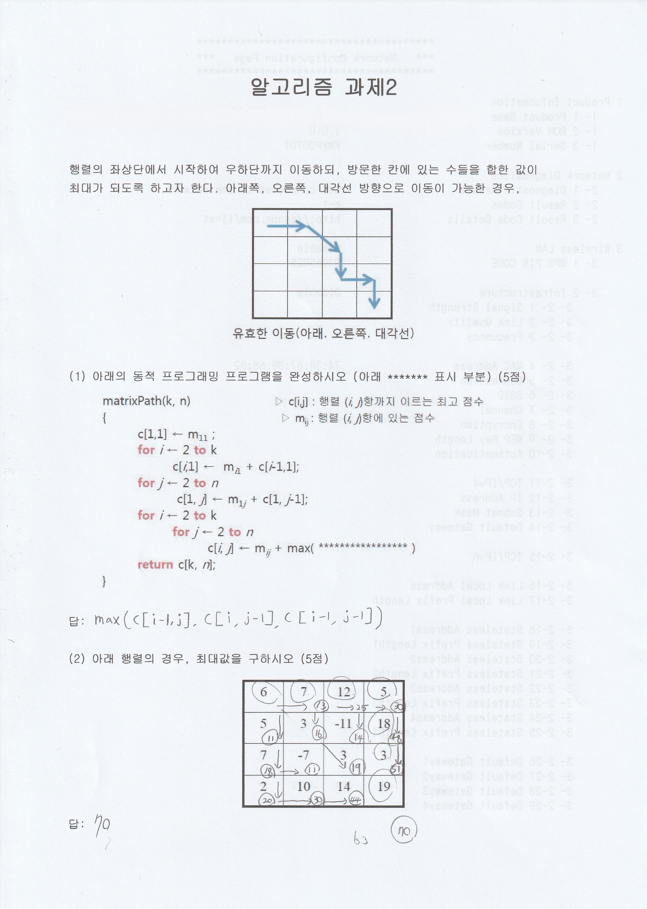

# 알고리즘 (Algorithm)

**수강 학년:** 2학년 2학기 (2nd Grade, 2nd Semester)
**사용 언어:** Python

## 📖 과목 소개 & 배운 점

자료구조를 바탕으로, 특정 문제를 해결하기 위한 가장 효율적인 절차와 방법을 설계하고 분석하는 능력을 기르는 컴퓨터 과학의 핵심 과목입니다. **점근적 표기법(Big-O)**을 이용한 알고리즘의 **시간 복잡도 분석**부터 시작하여, **정렬, 검색, 동적 프로그래밍, 그래프** 등 다양한 문제 영역에 대한 핵심 알고리즘 설계 기법을 학습했습니다. 이 과목을 통해 단순히 코드를 작성하는 것을 넘어, '더 나은 코드'와 '효율적인 해결책'이 무엇인지 깊이 있게 고민하고 증명하는 능력을 기를 수 있었습니다.

## ✏️ 이 과목을 통해 얻은 핵심 역량

-   **알고리즘 성능 분석:** 점근적 표기법(O, Ω, Θ)과 점화식을 이해하고, 알고리즘의 최악/평균 경우에 대한 **시간 복잡도를 분석**하는 능력.
-   **주요 정렬 및 선택 알고리즘 이해:** **O(n²)** 정렬(선택, 버블, 삽입)과 **O(n log n)** 고급 정렬(병합, 퀵, 힙)의 동작 원리 및 성능 차이를 이해.
-   **효율적인 검색 자료구조:** **이진검색트리(BST), 레드블랙트리, 해시 테이블** 등 다양한 검색 자료구조의 특징과 시간 복잡도를 이해.
-   **고급 알고리즘 설계 기법:** **동적 프로그래밍(Dynamic Programming)**과 **그래프 알고리즘(DFS, BFS, MST, 최단 경로)** 등 문제 해결을 위한 핵심 설계 기법을 학습.

## 💡 주요 과제 및 프로젝트

### 1. 선택 정렬 (Selection Sort) 알고리즘 구현
-   **소스 파일:** `selection-sort.py`
-   **설명:** 수업에서 배운 기초 정렬 알고리즘 중 **선택 정렬**을 Python으로 직접 구현하고, 주어진 숫자 배열이 단계별로 정렬되는 과정을 출력하는 과제를 수행했습니다.
-   **배운 점:** 이론으로만 배우던 정렬 알고리즘을 실제 코드로 구현하며 내부 동작 원리를 완벽하게 체득했습니다. 또한, 이중 `for` 루프를 통해 **O(n²)의 시간 복잡도**를 갖는 과정을 직접 확인하는 경험을 했습니다.

**[실행 결과]**

---

### 2. 동적 프로그래밍 (Dynamic Programming) 문제 해결
-   **설명:** 주어진 n x n 행렬의 좌상단에서 우하단까지 이동할 때, 방문한 칸의 합이 최대가 되는 경로를 찾는 문제를 **동적 프로그래밍(DP)**의 원리를 이용하여 해결하는 과제를 수행했습니다.
-   **배운 점:** 큰 문제의 해답이 작은 문제들의 해답에 포함되는 **최적 부분 구조(Optimal Substructure)**를 파악하고, 이를 점화식으로 표현하여 DP 테이블을 채워나가는 동적 프로그래밍의 핵심 원리를 학습했습니다.

**[과제 풀이]**

