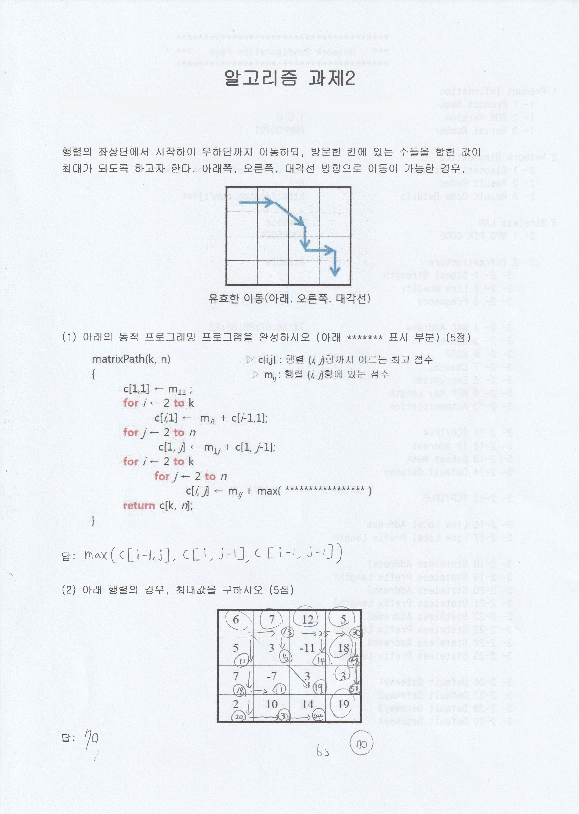

# 알고리즘 (과제 모음)

알고리즘 과목에서 Python으로 구현한 과제 코드입니다. 정렬 두 개, 동적 계획법 하나, 그래프 탐색 하나로 모두 네 개입니다.

과목 개요와 과제 설명은 [Notion 노트](https://www.notion.so/acefcdbd8fbb4aea8b06e1560df610c6?source=copy_link)에 있습니다.

## 구현한 것

| 파일 | 내용 |
| --- | --- |
| [`selection-sort.py`](selection-sort.py) | 선택 정렬. 남은 구간에서 가장 큰 값을 찾아 맨 뒤와 교환하고, 단계마다 배열 상태를 출력합니다. |
| [`merge_sort.py`](merge_sort.py) | 병합 정렬. 재귀로 반씩 쪼갠 뒤 합칩니다. 제자리 정렬이 아니라 새 리스트를 돌려줍니다. |
| [`edit_distance.py`](edit_distance.py) | 편집 거리. (n+1)×(m+1) 크기의 DP 표를 채우고 삭제·삽입·교체 비용을 각각 1로 둡니다. |
| [`bfs_shortest.py`](bfs_shortest.py) | BFS 최단 경로. 가중치 없는 무방향 그래프에서 시작 정점까지의 거리를 반환하고, 닿지 않는 정점은 -1로 남깁니다. |

## 실행

`__main__` 블록이 있는 건 `selection-sort.py` 하나뿐입니다.

```bash
python selection-sort.py
```

나머지 세 개는 함수만 들어 있어서 그냥 실행하면 아무것도 출력되지 않습니다. 불러다 써야 합니다.

```python
from edit_distance import edit_distance
from bfs_shortest import bfs_shortest

print(edit_distance("sunday", "saturday"))          # 3
print(bfs_shortest(6, [(0,1),(1,2),(2,3),(0,4)], 0))  # [0, 1, 2, 3, 1, -1]
```

## 실행 결과

선택 정렬은 교환이 일어날 때마다 배열을 찍게 해서 어느 자리가 확정되는지 눈으로 확인했습니다. 원소 8개면 마지막 한 자리는 저절로 정해지므로 단계가 7까지만 나옵니다.


편집 거리는 점화식만 봐서는 감이 안 잡혀서 DP 표를 직접 채워보며 확인했습니다. 아래가 그 표와 경로입니다.


