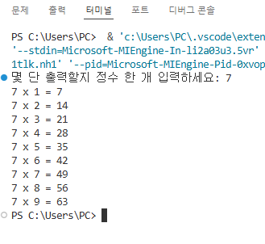

# C프로그래밍 과제 모음

C프로그래밍 수업에서 제출한 과제 4개입니다. 소스와 실행 결과 캡처를 같이 두었습니다.

과목 노트는 노션에 있습니다: [C프로그래밍](https://www.notion.so/C-1248dba48e4441c08aba5c31b0597cf3?source=copy_link)

네 파일 모두 수업에서 쓰던 형태 그대로 `void main(void)` 으로 작성했습니다.

## 과제

### 1. 대소문자 변환 ([case-converter.c](./case-converter.c))

소문자 한 글자를 입력받아 대문자로 바꿔 출력합니다. 아스키 코드 차이인 32를 빼는 방식입니다.
문자열이 아니라 문자 하나만 처리하고, 소문자에서 대문자로 가는 한 방향만 있습니다.
`'a' <= n && n <= 'z'` 조건 안에서만 출력하기 때문에 대문자나 숫자를 넣으면 아무것도 찍히지 않습니다.


### 2. 포인터로 최댓값·최솟값 찾기 ([find-max-min-pointer.c](./find-max-min-pointer.c))

정수 두 개를 입력받아 큰 수와 작은 수를 출력합니다.
`FindMaxMin(int a, int b, int *max, int *min)` 이 값을 반환하지 않고 포인터로 받은 자리에 직접 써 넣습니다.
`return` 은 하나뿐인데 결과가 두 개라서 포인터를 쓴 과제였습니다.


### 3. 구구단 출력 ([multiplication-table.c](./multiplication-table.c))

출력할 단을 정수로 입력받아 1배부터 9배까지 찍습니다.
반복문을 쓰지 않고 `printf` 9줄을 그대로 나열한 상태로 제출했습니다. `for` 로 줄이면 세 줄이면 끝나는 코드입니다.



### 4. XOR 암호화·복호화 ([simple-xor-cipher.c](./simple-xor-cipher.c))

입력받은 단어를 한 글자씩 키 값 3과 XOR 해서 암호문을 만들고, 같은 연산을 한 번 더 걸어 원문으로 되돌립니다.
같은 값을 두 번 XOR 하면 원래 값이 나온다는 성질을 확인하는 과제였습니다.
키는 3으로 고정이고 버퍼는 30바이트라서 긴 단어를 넣으면 넘칩니다.


## 실행

GCC가 있는 환경(Linux, macOS, Windows의 WSL 또는 MinGW)에서 컴파일해 실행합니다.

```bash
gcc case-converter.c -o case-converter
./case-converter
```
