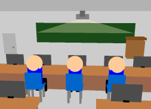

# 컴퓨터 그래픽스 (Computer Graphics)

**수강 학년:** 2학년 2학기 (2nd Grade, 2nd Semester)
**사용 언어 및 라이브러리:** C++, OpenGL (GLUT)

## 📖 과목 소개 & 배운 점

2D 및 3D 그래픽이 컴퓨터 화면에 어떻게 그려지는지에 대한 근본적인 원리를 배우는 과목입니다. 컴퓨터가 가상의 물체를 표현하고, 시점을 변환하며, 빛과 색을 계산하는 수학적 원리를 깊이 있게 학습했습니다. 특히, **OpenGL** 라이브러리를 사용하여 직접 3D 객체를 렌더링하고 애니메이션을 구현하면서, **수학적 모델이 어떻게 생동감 있는 시각적 결과물로 변환되는지** 직접 경험할 수 있었습니다.

## ✏️ 이 과목을 통해 얻은 핵심 역량

-   **3D 그래픽스 렌더링 파이프라인 이해:** 정점 처리, 래스터화 등 3D 그래픽스가 화면에 그려지는 전체적인 흐름을 이해.
-   **행렬을 이용한 3D 변환:** 이동(Translate), 회전(Rotate), 크기 변환(Scale) 등 3D 변환을 위한 핵심적인 **선형대수학 지식을 코드로 직접 활용**하는 능력.
-   **카메라 및 시점 제어:** 가상의 카메라 위치와 방향을 결정하는 **시점 변환(Viewing Transformation)**의 원리를 이해하고 `gluLookAt()` 함수 등을 활용하는 능력.
-   **OpenGL API 활용 능력:** `glBegin/glEnd`, `glVertex`, 콜백 함수, 더블 버퍼링, 정점 배열 등 OpenGL의 핵심 기능을 사용하여 2D/3D 애플리케이션을 개발하는 능력.

## 💡 주요 개발 프로젝트

### 팀 프로젝트: '재난 안전 교육' 3D 애니메이션 (지진 대피 요령)
-   **소스 파일:** `disaster-safety-animation.zip` (또는 `.cpp` 파일)
-   **프로젝트 설명:**
    -   **OpenGL**을 활용하여 지진 발생 시 대피 요령을 알려주는 3D 교육용 애니메이션을 제작하는 팀 프로젝트를 진행했습니다.
    -   교실, 복도, 계단, 운동장으로 이어지는 공간을 3D로 모델링하고, 캐릭터들이 시나리오에 따라 안전하게 대피하는 과정을 애니메이션으로 구현했습니다.

-   **나의 역할 및 기여:**
    -   **메뉴 및 이벤트 처리:** GLUT의 메뉴 콜백 함수를 활용하여, 마우스 오른쪽 클릭 시 '도형 변경', '크기 변경', '종료' 등의 옵션을 선택할 수 있는 **팝업 메뉴를 구현**했습니다.
    -   **카메라 제어 프로그래밍:** `gluLookAt()` 함수와 키보드 입력 콜백을 연동하여, 사용자가 **키보드 방향키로 카메라 시점을 자유롭게 이동**하며 3D 공간을 둘러볼 수 있는 기능을 구현했습니다.

-   **배운 점:**
    -   수업에서 배운 모든 이론과 기술을 종합하여 **하나의 완성된 3D 애플리케이션을 기획하고 개발하는 전체 과정**을 경험했습니다.
    -   팀원들과의 협업을 통해 각자의 역할을 분담하고 소통하는 능력을 길렀으며, 특히 행렬 변환이 카메라 워크와 같은 동적인 시점 변화에 어떻게 핵심적으로 사용되는지 깊이 있게 이해할 수 있었습니다.

**[최종 결과물]**

*
OpenGL로 구현한 3D 지진 대피 교육 애니메이션의 한 장면
*