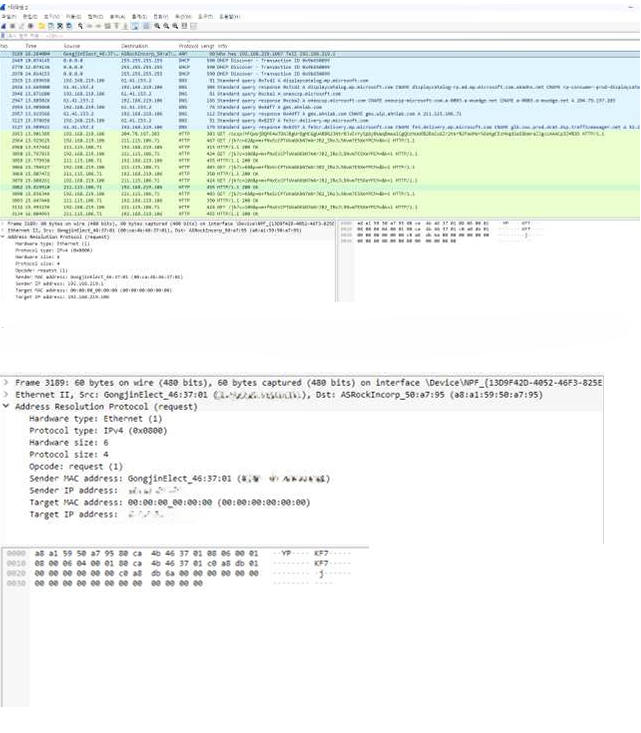

# Computer Networks Notes

프로토콜 스택을 계층별로 이해하고 실전 패킷 분석으로 문제를 진단하는 학습 노트입니다. IPv4/IPv6, ARP, TCP, 혼잡 제어를 Wireshark와 간단한 소켓 실습으로 확인합니다.

- 학년: 2학년
- 과목: 컴퓨터 네트워크
- 도구: Wireshark, tcpdump, Python socket
- 목적: 보고서·캡처·분석 절차 아카이브

## 폴더 구조

- assets  
  - ipv6-report.png  
  - wireshark-arp-analysis.png
- README.md
- (선택) scripts, captures, docs

## 3줄 요약

- 인터넷 프로토콜 스택의 동작을 계층별로 정리하고 헤더 필드를 근거로 해석
- IPv6 주소 설계, ARP 해석, TCP 3-way·혼잡 제어를 실습으로 검증
- 재현 가능한 캡처 필터와 분석 루틴을 문서화해 트러블슈팅 기반 마련

## 핵심 개념 5개

1) 주소 체계: IPv4 vs IPv6  
- IPv6는 128비트 주소, 확장 헤더, 멀티/애니캐스트 지원. 전환은 듀얼스택·터널링·NAT64  
// 언제/왜: 주소 고갈 해소, 대규모·IoT 네트워크 확장성

2) ARP와 L2 브로드캐스트  
- ARP Request: Who has <IP>? Tell <Sender IP/MAC>  
// 언제/왜: 같은 브로드캐스트 도메인에서 IP→MAC 매핑, ARP 스푸핑 탐지

3) TCP 연결 수립과 종료  
- 3-way handshake, 4-way 종료. MSS·윈도·옵션으로 전송 특성 협상  
// 언제/왜: 지연·재전송 원인 파악, 방화벽/로드밸런서 동작 검증

4) 혼잡 제어와 흐름 제어  
- 슬로우스타트→혼잡회피(AIMD). 수신 윈도는 흐름, cwnd는 혼잡 제어 지표  
// 언제/왜: RTT 급등·스루풋 저하 분석, BDP 기반 버퍼·윈도 튜닝

5) 캡처·필터링 루틴  
- 디스플레이: arp || icmp || tcp.port==80  
- 캡처: host 192.168.0.10 and not port 22  
// 언제/왜: 관심 트래픽만 좁혀 재현성·분석 속도 향상

## 실습 메모

- IPv6 접두사/인터페이스 ID 혼동 → hextet 압축 규칙·프리픽스 길이 표로 정리 → 주소 표기 오류 제거  
- ARP 캡처 범람 → 캡처 필터(ether dst ff:ff:ff:ff:ff:ff)와 디스플레이 필터 분리 → 원인 구간만 추출  
- TCP 재전송 오탐 → MSS 미스매치 확인, MTU/DF 및 PMTUD 점검 루틴 추가

## 제출 전 체크리스트

- [ ] 캡처 환경(인터페이스, 필터, 시간대)을 기록했다  
- [ ] 계층별 헤더 필드에서 근거를 라벨링했다(IPv6, TCP 옵션 등)  
- [ ] 가설→증거 패킷→결론 흐름으로 서술했다  
- [ ] 보조 실험(ping, traceroute, 간단 소켓 테스트)을 포함했다  
- [ ] 무관한 패킷/로그는 부록으로 분리했다

## 스크린샷

<table>
  <tr>
    <td align="center"><strong>IPv6 조사 보고서</strong></td>
    <td align="center"><strong>Wireshark ARP 패킷 분석</strong></td>
  </tr>
  <tr>
    <td></td>
    <td></td>
  </tr>
</table>

## 빠른 참고

- Wireshark Display Filter: https://www.wireshark.org/docs/dfref/  
- RFC 8200 (IPv6): https://www.rfc-editor.org/rfc/rfc8200  
- 소켓 실습 예시(간단 echo 서버/클라이언트) 추가 가능

## Notion Page
- Computer Networks: https://www.notion.so/0e9573ac966c4806932cc0e7f5d09eef
