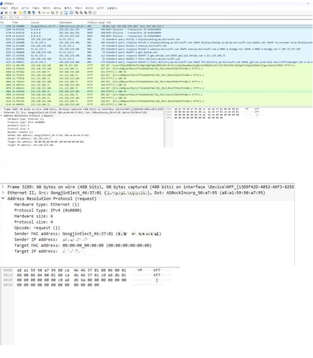

# 컴퓨터 네트워크

2학년 컴퓨터 네트워크 과목에서 제출한 과제 두 건입니다. 코드 과제가 아니라 분석·조사 과제였기 때문에, 이 폴더에는 보고서 결과 화면 두 장만 들어 있습니다.

과목 정리 노트: [컴퓨터 네트워크 (Notion)](https://www.notion.so/1cc8c0288a874019ac3ddf0a9642676a?source=copy_link)

## 1. Wireshark 로 ARP 동작 분석

캡처한 패킷 중 ARP 요청 프레임 하나(60바이트)를 골라 상세 창에서 계층별로 펼쳐 봤습니다.

- Ethernet II 계층: 출발지 `GongjinElect_46:37:01`, 목적지 `ASRockIncorp_50:a7:95`
- Address Resolution Protocol 계층: Hardware type `Ethernet (1)`, Protocol type `IPv4 (0x0800)`, Hardware size `6`, Protocol size `4`, Opcode `request (1)`
- Sender MAC / IP 와 Target MAC / IP

요청 프레임에서 Target MAC 이 `00:00:00:00:00:00` 으로 비어 있다는 게 눈에 들어왔습니다. 상대 MAC 을 모르니까 묻는 것이고, 그 빈칸 자체가 ARP 가 존재하는 이유라는 걸 화면에서 바로 확인할 수 있었습니다. 프로토콜을 글로 읽을 때보다 하단 hex 창에서 필드를 바이트 단위로 세어 보는 쪽이 훨씬 빨리 이해됐습니다.

## 2. IPv6 주소 체계 조사

IPv4 주소 고갈 문제와 IPv6 가 그것을 어떻게 푸는지 조사해 정리한 보고서입니다.

- **주소 길이**: IPv4 는 32비트(8비트짜리 4섹션), IPv6 는 128비트(16비트짜리 8섹션)이고 섹션 구분자는 점이 아니라 콜론입니다.
- **표기 축약**: 연속으로 0 이 오는 섹션은 `::` 로 줄여 씁니다.
- **주소 구조**: 앞쪽 네트워크 부분(Prefix)과 뒤쪽 호스트 부분(Suffix)으로 나뉩니다.
- **주요 특성 세 가지**: 확장된 주소 공간, IPSec 을 통한 암호화, 멀티캐스트와 애니캐스트 지원.

멀티캐스트와 애니캐스트는 설명만 읽으면 둘 다 "여러 대상에게 보내는 것" 처럼 보여서 헷갈렸습니다. 그래서 보고서에 두 방식을 한 표에 나란히 놓고 정리했습니다. 멀티캐스트는 그룹에 속한 수신자 전부에게 보내고, 애니캐스트는 그중 가장 가까운 노드 하나에만 보낸다는 점이 다릅니다.

