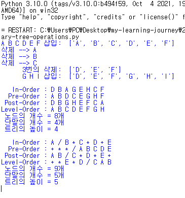

# Data Structures Notes

스택·큐·트리·힙 등 핵심 자료구조를 Python으로 직접 구현하고, 연산 복잡도를 근거와 함께 정리한 학습 노트입니다.

- 학년: 2학년
- 언어: Python 3.11+
- 목적: 과제 코드와 실행 결과, 핵심 개념 요약 아카이브

## 구조

- assets
  - binary-tree-operations-result.png
  - huffman-coding-result.png
  - ds-note-bst-creation.png
  - ds-note-heap-insertion.png
  - data-structures-notes.pdf
- binary-tree-operations.py
- postfix-calculator.py
- huffman-coding.py
- README.md

## 3줄 요약

- 데이터 특성에 맞는 구조를 선택하고, 시간·공간 복잡도로 타당성을 설명
- 스택·큐·트리·힙을 직접 구현하며 ADT 인터페이스와 단위 테스트 습관 확립
- 입력 검증, 코드 스타일, 경계값 테스트를 일관되게 적용

## 핵심 개념 5개

1) Stack  
```python
class Stack:
    def __init__(self): self._a=[]
    def push(self,x): self._a.append(x)     # O(1)
    def pop(self):  return self._a.pop()    # O(1) amortized
# 언제/왜: RPN 계산, undo, 괄호 균형
```

2) Queue  
```python
from collections import deque
q=deque(); q.append(x); q.popleft()         # O(1)
# 언제/왜: BFS, 작업 스케줄링, 레벨 순회
```

3) Tree/BST  
```python
class Node:
    def __init__(self,k,l=None,r=None): self.k,self.l,self.r=k,l,r
def insert(t,k):
    if not t: return Node(k)
    if k<t.k: t.l=insert(t.l,k)
    elif k>t.k: t.r=insert(t.r,k)
    return t
# 언제/왜: 정렬된 탐색·순위, 중위순회=정렬 결과
```

4) Heap / Priority Queue  
```python
import heapq
pq=[]; heapq.heappush(pq,(w,x)); w,x=heapq.heappop(pq)  # O(log n)
# 언제/왜: 다익스트라, 허프만 코딩, 스케줄러
```

5) Hash Map 감각  
```python
freq={}
for ch in text: freq[ch]=freq.get(ch,0)+1  # 평균 O(1)
# 언제/왜: 카운팅, 인덱싱. 충돌시 최악 O(n) 인지
```

## 실습 메모

- RPN 계산기 토큰화에서 음수/공백 처리 → 토큰화 단계 분리, 정규식으로 단항/이항 구분  
- BST 중복 키 정책 혼재 → “중복 무시”로 계약 통일, 주석 명시  
- 허프만 코딩 비트 버퍼 오류 → 8비트 단위 flush, 패딩 비트 수 기록

## 제출 전 체크리스트

- [ ] 입력 검증과 예외 처리 적용
- [ ] 기능별 함수 분리, 단위 테스트 작성
- [ ] 반복/재귀의 종료 조건·불변식 점검
- [ ] black + ruff 또는 pylint로 스타일·린트 통과
- [ ] 핵심 연산 복잡도 O(1)/O(log n)/O(n) 표기

## 실행 예

```bash
python3 postfix-calculator.py
python3 binary-tree-operations.py
python3 huffman-coding.py
```

권장: python -m venv venv && source venv/bin/activate, ruff/black 설치

## 스크린샷

<table>
  <tr>
    <td align="center"><strong>Binary Tree Operations</strong></td>
    <td align="center"><strong>Huffman Coding</strong></td>
  </tr>
  <tr>
    <td></td>
    <td></td>
  </tr>
</table>

## 참고

- Python docs: collections.deque, heapq  
- CLRS 요약 정리 링크 추가 가능

## Notion Page
- Data Structures: https://www.notion.so/6d05cd2e94344baabf9b9f8eb4910227

