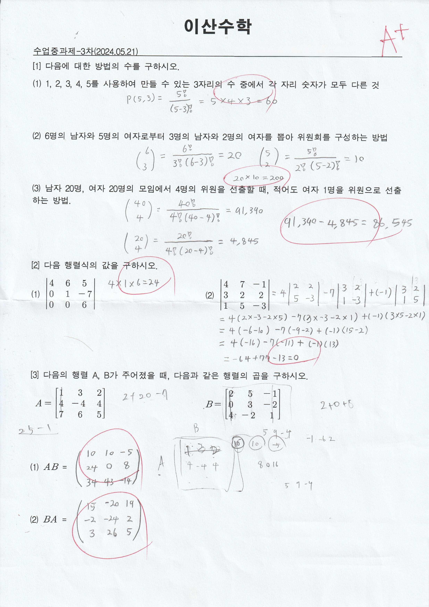
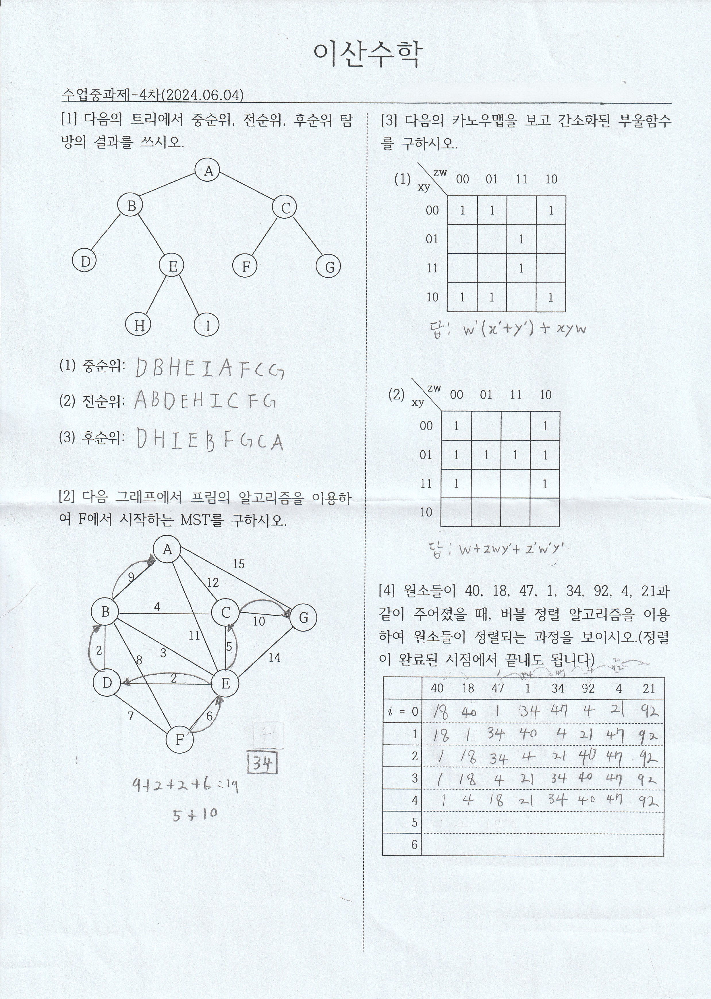

# 이산수학 (실습 모음)

이산수학 수업의 실습 과제를 모아둔 폴더입니다. 손으로 풀어 제출한 과제라 코드는 없고, 제출본을 스캔한 이미지 네 장이 전부입니다.

개념 정리와 수업 노트는 [Notion 노트](https://www.notion.so/295391b84d244078aaf34e6d1c3c6781?source=copy_link)에 있습니다.

## 폴더 구조

- [`assets/`](assets) : 실습 제출본 스캔 이미지 4장

## 실습 01: 명제와 술어 논리

명제 논리, 진리표, 한정자를 사용한 술어 논리 문제 풀이입니다.

## 실습 02: 집합, 관계, 증명법

집합의 관계 정의, 그래프와 행렬 표현, 대우증명법을 사용한 증명입니다.

## 실습 03: 경우의 수와 행렬

순열과 조합을 이용한 경우의 수 계산, 행렬 곱셈과 행렬식 풀이입니다.

## 실습 04: 트리, 그래프, 부울 대수

트리 순회, 최소 신장 트리(MST) 탐색, 카르노 맵을 이용한 부울 대수 간소화입니다.

