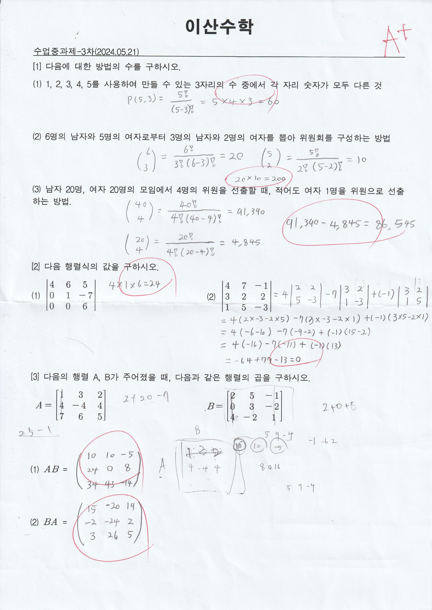

# 이산수학 (Discrete Mathematics)

**수강 학년:** 2학년 1학기 (2nd Grade, 1st Semester)

## 📖 과목 소개 & 배운 점

자료구조, 알고리즘, 운영체제 등 컴퓨터 과학의 여러 분야를 공부하는 데 필수적인 수학적 사고력과 논리적 문제 해결 능력을 기르는 과목입니다. 추상적인 문제를 수학적으로 모델링하고 해결하는 방법을 배우며, 복잡한 알고리즘을 이해하고 설계하는 데 필요한 탄탄한 이론적 기반을 다졌습니다.

## ✏️ 핵심 학습 내용

-   **논리와 명제 (Logic and Propositions):**
    -   `p∧q`, `¬(p∨q)` 등 논리 연산자를 사용하여 복합 명제를 기호 형태로 표현하고, 진리표를 통해 명제의 참/거짓을 분석하는 방법을 학습했습니다.
    -   술어 한정자를 사용하여 문장을 기호로 표현하는 방법을 익혔습니다.

-   **집합, 관계, 함수 (Sets, Relations, and Functions):**
    -   포함-배제의 원리를 이용하여 복수의 조건을 만족하는 집합의 원소 개수를 계산하는 방법을 학습했습니다.
    -   집합 간의 관계(Relation)를 좌표 도표, 방향 그래프, 관계 행렬 등 다양한 방식으로 표현하는 방법을 익혔습니다.

-   **조합론 및 행렬 (Combinatorics and Matrices):**
    -   순열(Permutation)과 조합(Combination)을 이용하여 특정 조건을 만족하는 경우의 수를 계산하는 방법을 익혔습니다.
    -   행렬의 곱셈 및 행렬식 계산 방법을 학습했습니다.

-   **그래프와 트리 (Graphs and Trees):**
    -   트리(Tree)의 전순위, 중순위, 후순위 순회(Traversal) 방법을 학습했습니다.
    -   그래프(Graph)에서 최소 신장 트리(MST)를 찾기 위한 프림(Prim) 알고리즘의 동작 원리를 이해했습니다.

-   **알고리즘 및 부울대수 (Algorithms and Boolean Algebra):**
    -   버블 정렬(Bubble Sort)과 같은 기본적인 정렬 알고리즘의 동작 과정을 이해했습니다.
    -   디지털 논리 회로의 기반이 되는 부울대수와 카노맵(Karnaugh map)을 이용한 논리식 간소화 방법을 학습했습니다.

---

## ✍️ 주요 과제 풀이 노트

수업 중 진행한 4차례의 과제 풀이를 통해, 위 개념들을 실제 문제에 적용하고 해결하는 연습을 꾸준히 진행했습니다.

