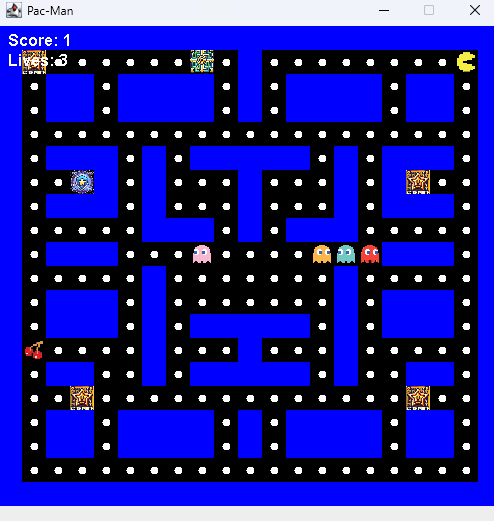

# 자바 프로그래밍 (Java Programming)

**수강 학년:** 2학년 2학기 (2nd Grade, 2nd Semester)

## 📖 과목 소개 & 배운 점

객체 지향 프로그래밍(OOP)의 정수인 Java를 통해, 더 크고 복잡한 규모의 소프트웨어를 체계적으로 설계하고 개발하는 방법을 학습했습니다. 단순한 문법 학습을 넘어, **캡슐화, 상속, 다형성** 등 OOP의 핵심 개념을 실제 코드로 구현하는 연습을 반복하며 **유지보수가 용이하고 확장성 높은 코드**를 작성하는 기반을 다졌습니다.

특히, **Swing을 이용한 GUI 프로그래밍**부터 **스레드를 활용한 동시성 제어**, **파일 입출력**, 그리고 **소켓을 이용한 네트워크 통신**까지 경험하며, 자바라는 언어를 통해 하나의 완성된 애플리케이션을 만들어내는 종합적인 개발 능력을 길렀습니다.

## ✏️ 이 과목을 통해 얻은 핵심 역량

-   **객체 지향 프로그래밍(OOP) 심화:**
    -   **클래스와 객체**를 통한 데이터 캡슐화.
    -   **상속(Inheritance), 다형성(Polymorphism), 추상 클래스, 인터페이스**를 활용한 유연하고 확장 가능한 코드 설계 능력.

-   **Java API 및 프레임워크 활용:**
    -   `String`, `Math` 등 핵심 API와 `Vector`, `HashMap` 같은 **컬렉션 프레임워크**를 능숙하게 활용하는 능력.
    -   **Swing**을 이용해 GUI 컴포넌트를 배치하고, 키보드/마우스 **이벤트**를 처리하여 사용자 인터페이스를 구현하는 능력.

-   **시스템 프로그래밍 기초:**
    -   **스레드(Thread)**를 생성하고 `synchronized` 키워드를 통해 동시성 문제를 제어하는 능력.
    -   **스트림(Stream)**의 개념을 이해하고, 텍스트 및 바이너리 파일 입출력을 구현하는 능력.
    -   **TCP 소켓(Socket)** 프로그래밍을 통해 클라이언트-서버 모델의 기본적인 네트워크 통신을 구현하는 능력.
    -   **JDBC**를 이용한 데이터베이스 프로그래밍의 기초를 학습했습니다.

## 💡 주요 개발 프로젝트

### Java Swing을 이용한 팩맨(Pac-Man) 게임 제작
-   **소스 파일:** `pacman-game`
-   **프로젝트 설명:**
    -   Java의 **Swing** 라이브러리를 활용하여 고전 게임인 **팩맨(Pac-Man)**을 구현했습니다. 플레이어는 키보드를 이용해 팩맨 캐릭터를 조종하여 맵의 모든 아이템을 먹어야 하며, 인공지능을 가진 고스트 캐릭터들은 팩맨을 추격합니다.
-   **주요 구현 내용:**
    -   **객체 지향 설계:** `Player`, `Ghost`, `Item` 등 게임의 모든 요소를 **클래스**로 설계하고, `GameCharacter`라는 추상 클래스를 만들어 `Player`와 `Ghost`가 **상속**하도록 구현했습니다.
    -   **GUI 및 그래픽 처리:** `JFrame`을 게임 창으로 사용하고, `JPanel`의 `paintComponent()` 메소드를 오버라이딩하여 게임 맵과 캐릭터들을 직접 그렸습니다.
    -   **키보드 이벤트 처리:** `KeyListener`를 구현하여 키보드 방향키 입력에 따라 팩맨이 상하좌우로 움직이도록 만들었습니다.
    -   **게임 루프 및 AI:** **스레드(Thread)**를 사용하여 게임의 상태를 주기적으로 업데이트하는 메인 루프를 구현했으며, 각 고스트 캐릭터도 별도의 스레드로 동작하며 팩맨을 추격하는 간단한 인공지능 로직을 구현했습니다.

-   **배운 점:**
    -   지금까지 배운 모든 Java 지식(OOP, GUI, 이벤트 처리, 스레드 등)을 총동원하여 **하나의 완성된 애플리케이션을 기획하고 개발하는 전체 과정**을 경험했습니다.
    -   특히, 스레드를 이용한 게임 루프와 캐릭터의 동시성 제어를 통해 **멀티스레드 프로그래밍**에 대한 깊은 이해를 얻을 수 있었습니다.

**[실행 화면]**

*
Java Swing으로 구현한 팩맨 게임 플레이 화면
*