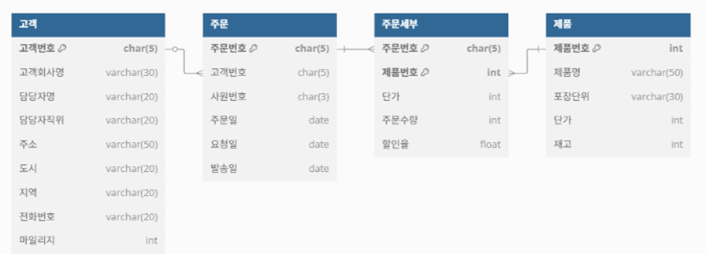
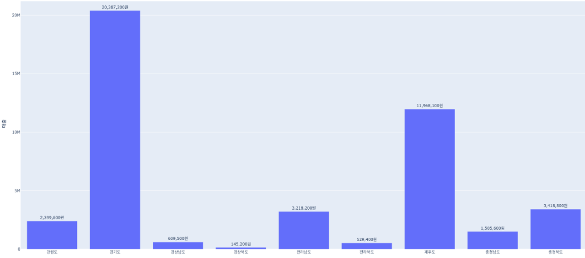

# 🗄️ 데이터베이스 (Database)

**[과목 정보]**
- **수강:** 3학년 1학기
- **핵심 기술:** `MySQL`, `SQL`, `Python(Pandas)`
- **핵심 역량:** `데이터베이스 설계(ERD)`, `데이터 분석 및 시각화`, `비즈니스 인사이트 도출`

---

## 📖 과목 개요 (Overview)
소프트웨어의 핵심인 데이터를 체계적으로 저장, 관리, 활용하는 역량을 배양한 과목입니다. 관계형 데이터베이스(RDBMS) 설계부터, **SQL과 Python을 활용한 데이터 추출 및 분석, 시각화를 통한 비즈니스 인사이트 도출**까지, 데이터 파이프라인의 전 과정을 종합적으로 경험했습니다.

## 🚀 핵심 프로젝트: '한빛무역' 판매 데이터 분석 및 시각화

- **프로젝트 기간:** 6주
- **분석 코드 (SQL & Python)**: `src/Mysql_Basic.py`, `src/Mysql_Visualization.py`
- **최종 발표 자료**: `docs/데이터베이스 PPT.pptx`
- **프로젝트 목표:** '한빛무역'의 판매 데이터베이스를 분석하여 **매출에 영향을 미치는 핵심 요인(지역, 제품군)을 파악**하고, 데이터 기반의 비즈니스 전략 수립을 위한 **구체적인 인사이트를 도출**합니다.

### 🛠️ 개발 및 분석 프로세스

1.  **데이터 모델링**: `dbdiagram.io`를 활용하여 고객, 주문, 제품 등 핵심 개체 간의 관계를 정의한 **ERD(개체-관계 다이어그램)를 설계**했습니다.
2.  **데이터 추출 및 전처리 (SQL)**:
    -   4개의 핵심 테이블(`고객`, `주문`, `주문세부`, `제품`)을 `JOIN`하여 분석에 필요한 통합 데이터셋을 구축했습니다.
    -   `CASE WHEN` 구문을 활용하여 200여 개의 제품명을 **의미 있는 12개의 '제품군'으로 재분류**하는 데이터 전처리 작업을 수행했습니다.
3.  **데이터 분석 및 시각화 (Python)**:
    -   `Pymysql`, `Pandas` 라이브러리를 사용해 MySQL DB와 연동하고, SQL 조회 결과를 DataFrame으로 변환했습니다.
    -   `Plotly` 라이브러리를 활용하여 **Sunburst, Bar, Pie 차트** 등 다각적인 시각화를 통해 지역별/제품군별 매출 구조를 분석했습니다.

### 📈 분석 결과 및 핵심 인사이트

-   **지역별 분석**: 전체 매출의 **약 81%가 경기도(46%), 제주도(27%), 충청북도(8%) 3개 지역에 집중**되어 있음을 확인했습니다. 특히 경기도는 음료류와 가공식품, 제주도는 다양한 품목에서 고른 매출을 보였습니다.
-   **제품군별 분석**: **음료류(29.5%), 가공식품(17.2%), 유제품(14.3%)이 전체 매출의 약 61%를 차지**하는 핵심 제품군임을 파악했습니다. 이는 소수의 인기 제품군에 대한 의존도가 높다는 것을 의미합니다.
-   **전략적 시사점**: 분석 결과를 바탕으로, **매출 집중 지역/제품군에 대한 마케팅 강화** 및 **매출 부진 영역에 대한 원인 분석과 개선 전략** 수립의 필요성을 제시했습니다.

### 🌱 성장 및 핵심 경험 (Growth & Takeaways)
-   정형 데이터를 **단순히 저장하는 것을 넘어, 비즈니스 가치를 창출하는 정보로 변환**하는 데이터 분석의 전 과정을 주도적으로 경험했습니다.
-   **SQL**을 통한 복잡한 데이터 추출/가공 능력과 **Python**을 활용한 자동화 및 시각화 역량을 동시에 함양했습니다.
-   이 경험은 향후 대규모 머신러닝 모델의 학습 데이터를 준비하고, **모델의 예측 결과를 분석하여 서비스 개선에 기여**하는 MLOps 엔지니어의 핵심 역량에 대한 깊은 이해를 제공했습니다.

### 📸 최종 결과물 (Visualizations)

| 데이터 모델링 (ERD) | 지역별 매출 (Bar Chart) | 제품군별 비중 (Pie Chart) |
| :---: | :---: | :---: |
|  |  |  |
*
프로젝트의 핵심 결과물: ERD 설계, 지역별 및 제품군별 매출 시각화
*

---
> ↩️ **[전체 학습 로드맵으로 돌아가기](../../README.md)**
