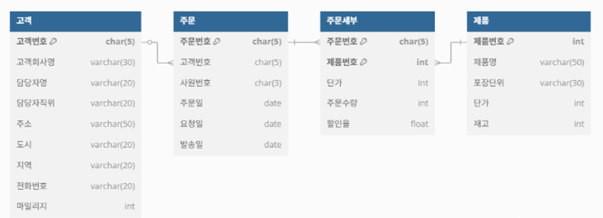
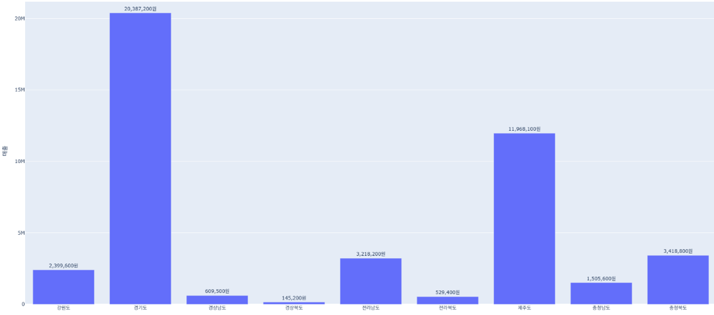

# 데이터베이스

MySQL 로 진행한 데이터베이스 수업의 SQL 실습과 Python 과제 코드입니다.
실습 데이터베이스는 교재 『난생처음 SQL』(배은영)의 예제 스키마인 `한빛무역` 을 그대로 썼습니다.
개념 정리는 [노션 노트](https://www.notion.so/35022bdc23414db19a6675643860774a?source=copy_link)에 따로 있습니다.

## 폴더 구조

| 폴더 | 내용 |
| --- | --- |
| [`labs/`](labs/) | 챕터별 SQL 실습과 점검문제, 실습문제 |
| [`src/`](src/) | Python 으로 MySQL 에 접속해 매출을 집계하고 시각화한 과제 |
| [`data/`](data/) | 한빛무역 CSV 7개와 DB 생성 스크립트, 서울 지하철 공개 데이터(승하차·공기질) |
| [`docs/`](docs/) | 과제 발표 자료 `database-presentation.pptx` (2025-05-25) |
| [`assets/`](assets/) | 이 README 에 쓰는 이미지 |

## 실습 스키마

`한빛무역` 은 부서, 사원, 고객, 제품, 주문, 주문세부, 마일리지등급 7개 테이블입니다.
아래 ERD 는 그중 매출 집계에 실제로 조인하는 4개만 그린 것입니다.



`주문세부` 의 기본키는 (주문번호, 제품번호) 복합키입니다.

## 챕터별 실습

| 챕터 | 다룬 내용 |
| --- | --- |
| [01. SQL 기초](labs/chapter-01-sql-basics/README.md) | 데이터의 형태, DBMS, 관계형 모델, SQL 분류 (정리 노트) |
| [02. 기본 질의문과 연산자](labs/chapter-02-basic-queries/) | SELECT, WHERE, ORDER BY, LIMIT, DISTINCT, IN, BETWEEN, LIKE, IS NULL |
| [03. 단일 행 함수](labs/chapter-03-single-row-functions/) | 문자열 함수, 숫자형 함수, 날짜·시간형 함수, 기타 단일 행 함수 |
| [04. 집계 함수](labs/chapter-04-aggregate-functions/) | 집계 함수 개요와 심화, GROUP BY, WITH ROLLUP |
| [05. 조인](labs/chapter-05-joins/) | CROSS JOIN, INNER JOIN(이퀴·비이퀴), OUTER JOIN, SELF JOIN |
| [06. 서브쿼리](labs/chapter-06-subqueries/) | 반환 값·사용 위치에 따른 구분, 복수 행, 상관 서브쿼리, 다중 컬럼 |
| [07. DML](labs/chapter-07-dml/) | INSERT, UPDATE, DELETE, UPSERT |
| [08. DDL](labs/chapter-08-ddl/) | CREATE, ALTER, DROP, 제약조건 |

각 챕터 폴더에는 수업 예제 외에 점검문제와 실습문제 풀이가 같이 들어 있습니다.

## Python DB 연동 과제

`src/` 에 두 개가 있습니다. 쿼리는 같고 출력만 다릅니다.

- [`Mysql_Basic.py`](src/Mysql_Basic.py) : pymysql 로 접속해 고객, 주문, 주문세부, 제품을 세 번 조인하고 지역·제품군·제품별 매출을 집계합니다. 결과를 pandas DataFrame 으로 받아 지역별 합계와 제품군별 비중을 콘솔에 출력합니다.
- [`Mysql_Visualization.py`](src/Mysql_Visualization.py) : 같은 쿼리를 SQLAlchemy 로 읽어 plotly 로 그립니다. 지역에서 제품군, 제품명으로 내려가는 3단 sunburst 와 지역별 막대, 제품군별 도넛 세 장입니다.

`제품` 테이블에는 제품군 컬럼이 없습니다. 그래서 제품명을 `LIKE` 로 훑어 `CASE` 로 11개 군(음료류, 가공식품, 유제품 등)을 직접 만들었습니다. 어느 패턴에도 안 걸리는 제품은 `ELSE '기타'` 로 남겨 뒀는데, 그 기타가 전체 매출의 5.73% 였습니다. 제품명 문자열에 분류를 의존하면 이 정도가 새어 나갑니다.

지역 값이 빈 문자열인 고객은 `WHERE 고객.지역 != ''` 으로 뺐습니다. matplotlib 은 OS 마다 한글 폰트가 달라서 `set_korean_font()` 를 따로 두고 `axes.unicode_minus = False` 를 같이 넣었습니다.

### 결과

지역별 매출 합계입니다. 9개 지역 중 경기도가 20,387,200원으로 가장 크고, 제주도가 11,968,100원으로 뒤를 잇습니다.



제품군별 매출 비중입니다. 음료류 29.5%, 가공식품 17.2%, 유제품 14.3% 순입니다.


발표 자료에는 상위 3개 지역(경기·제주·충북)이 전체 매출의 81%, 상위 3개 제품군이 약 61% 를 차지한다는 요약을 넣었습니다.

## 실행

SQL 파일은 MySQL Workbench 나 DBeaver 에서 열어 실행합니다. 그 전에 `data/hanbit-trade-data/한빛무역-데이터베이스생성스크립트.sql` 로 스키마를 만들고 CSV 를 넣어야 합니다. 생성 스크립트에는 테이블 정의만 있고 데이터는 없습니다.

Python 파일은 아래 패키지를 설치한 뒤 실행합니다. 접속 정보는 각 파일 위쪽 `DB_CONFIG` 와 `DB_URL` 에 하드코딩되어 있어서 본인 환경에 맞게 고쳐야 합니다.

```bash
pip install pymysql pandas sqlalchemy plotly matplotlib
python src/Mysql_Basic.py
python src/Mysql_Visualization.py
```
